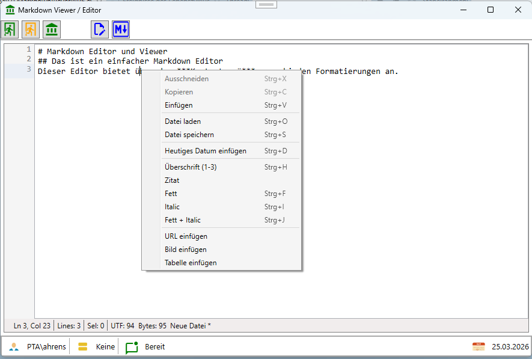

# MarkdownViever als WPF Anwendung


]

## Features des MarkdownViever

Der MarkdownViewer ist als eigenes Control implementiert, das in WPF-Anwendungen eingebettet werden kann.


Grundsätzlich werden die Unterstützung von Standard-Markdown-Syntaxelementen verarbeite.
Folgende Funktionen werden dabei unterstützt:

| Funktion | Beschreibung |
|---|---|
| # Titel | Titel, oberste Ebene |
| ## Titel | Titel, eine Ebene tiefer|
| ### Titel | Titel, untere Ebene tiefer|
| *Italic* | Italic geschrieben|
| **Fett** | Fett geschrieben|
| ***Fett und Italic*** | Fett und Italic geschrieben|
| `var x = 5;` | Inline Code|
|```var x = 5;```| Codeblock |
| [GitHub](https://github.com/GerhardAhrens?tab=repositories) | anklickbarer Web Link|
|| Bild als URL oder Datei |
|| Bild aus WPF Resource|
| Tabelle | Beliebige Zeilen und Spalten mit automatischer Spaltenbreite|

### Hinweis zu Bildern
Bilder die aus einer WPF Resource gelesen mit (res:) werden, müssen als "Ressource" festgelegt werden.


## Features des MarkdownEditor
Der MarkdownEditor ist als eigenes Control implementiert, das in WPF-Anwendungen eingebettet werden kann.
Der Editor hat links eine Zeilennummerierung, unten eine Statuszeile. Alle weiteren Funktionen werden über das Kontextmenü ausgeführt.

